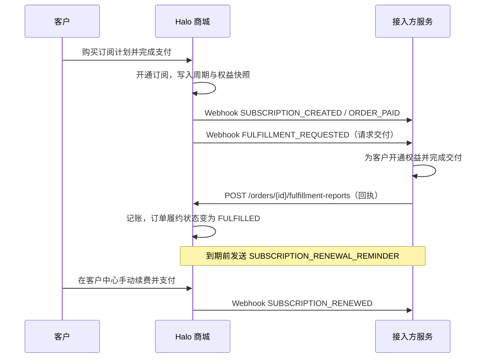

:::note 适用范围
本组文档适用于 **Halo 商城版 2.27.0 及以上版本**。订阅能力仅 [Halo 商城版](../../guide/prepare.md#发行版本) 提供。
:::

订阅对接的目标是让 Halo 商城负责**售卖、收款、记录周期**，接入方负责**解释权益、实际交付并回执**。Halo 不解释权益的具体含义，也不会自行判定接入方是否已经交付——这两件事通过 Webhook 与履约上报接口交给接入方。

## 职责分工

| Halo 商城                                  | 接入方                         |
| ------------------------------------------ | ------------------------------ |
| 产品线、档次（权益契约）、计划、价格与周期 | 定义 `entitlements` 的键与语义 |
| 购物车、结算、支付、订单                   | 按事件开通、调整、关闭业务权益 |
| 订阅状态机、续费订单、宽限期、过期         | 用量计量、并发与功能限制       |
| 计划变更报价与折算、变更订单               | 读取订阅快照做鉴权             |
| 订单与订阅事件 Webhook                     | 交付完成后调用履约上报接口回执 |
| 客户中心（客户自助续费、变更、取消）       | 通知、风控、退款等业务规则     |

接入方**不需要**自己实现支付页：店面购买，以及客户中心的续费、变更、取消都由 Halo 提供。

## 接入方式

推荐的接入形态是一个**独立的外部服务**：接收 Halo 的出站 Webhook，并在需要时调用 Halo 的 Console API。这也是当前完整支持订阅业务流程的形态。

| 方向                  | 通道                                   | 用途                                 |
| --------------------- | -------------------------------------- | ------------------------------------ |
| 出站（Halo → 接入方） | Webhook（HTTP POST，HMAC-SHA256 签名） | 订阅生命周期事件、订单事件、交付请求 |
| 入站（接入方 → Halo） | Console REST API + 个人令牌            | 履约上报、订单与订阅查询             |

### 关于 Halo 插件

订阅对接**不需要也不支持**通过 Halo 插件扩展商城模块：商城与订阅模块当前不提供插件扩展点（extension point），也不会把订单、订阅事件派发给插件。插件可以自行提供 REST API、自定义模型和角色，这是 Halo 的通用能力，但订阅业务流程仍然只能通过上面的两种通道完成。

因此，除为 Halo 增加与订阅无关的自定义功能外，请把接入方实现为独立的外部服务。

## 端到端时序

## 接入准备

1. **创建专用用户与角色**：在控制台新建一个 Halo 用户（建议只用于对接），并绑定角色**「订单发货上报」**（`role-template-report-ecommerce-fulfillments`）。
2. **签发个人令牌**：用该用户登录用户中心，进入**个人令牌**创建令牌，只勾选上一步的角色。令牌只在创建时显示一次，请妥善保存。
3. **确认访问地址**：Console API 前缀为 `https://{host}/apis/console.api.ecommerce.halo.run/v1alpha1`，请求头携带 `Authorization: Bearer pat_xxx`。令牌创建方式见[个人中心 / 个人令牌](../../guide/use/user-center.md#个人令牌)，认证方式说明见 [RESTful API 介绍](../restful-api/introduction.md#认证方式)。
4. **配置 Webhook**：在控制台 **Webhook** 中新建配置，填写回调 URL 与密钥，并订阅需要的[订阅事件](./subscription-webhook.md)。操作步骤见[商城 / Webhook](../../guide/shop/webhooks.md)。
5. **记录对接标识**：产品线的 `productId`、档次的 `handle`、计划的 `planId` 与 `variantId`。后续所有对账都依赖这些标识。

:::warning 令牌权限范围
「订单发货上报」角色只有读取订单与上报发货两项权限。控制台的订阅查询、权益查询等接口属于 Console 分组，需要管理员权限的个人令牌；请勿把管理员令牌交给第三方服务。
:::

## 最小闭环

1. 运营在控制台配置 `productType=SUBSCRIPTION` 的产品线、档次与计划，详见[订阅生命周期](./subscription-lifecycle.md#数据模型)。
2. 接入方订阅 `SUBSCRIPTION_*` 事件与 `FULFILLMENT_REQUESTED`。
3. 客户下单支付后，接入方按 `SUBSCRIPTION_CREATED` / `SUBSCRIPTION_TRIAL_STARTED` 载荷中的 `effectiveEntitlements` 开通权益。
4. 收到 `FULFILLMENT_REQUESTED` 后完成交付，并调用[履约上报接口](./fulfillment-callback.md)回执；**不上报，订单会一直停留在待发货**。
5. 收到 `SUBSCRIPTION_CANCELLED` / `SUBSCRIPTION_EXPIRED` 后停用权益；收到 `SUBSCRIPTION_PLAN_CHANGED` / `SUBSCRIPTION_RENEWED` 后按新快照刷新。

## 本组文档

| 文档                                        | 内容                                                             |
| ------------------------------------------- | ---------------------------------------------------------------- |
| [订阅生命周期](./subscription-lifecycle.md) | 数据模型、状态机、周期与试用、续费与变更、权益截止判定、查询接口 |
| [订阅 Webhook](./subscription-webhook.md)   | 投递格式、验签、重试与去重、订阅事件参考、载荷字段与处理建议     |
| [履约回调](./fulfillment-callback.md)       | 交付请求通知、发货上报接口、幂等语义、错误处理与对账             |

相关文档：

- [商城 / Webhook](../../guide/shop/webhooks.md)
- [商城 / 订单管理](../../guide/shop/orders.mdx)
- [商城 / 虚拟交付](../../guide/shop/virtual-delivery.mdx)
- [RESTful API 介绍](../restful-api/introduction.md)
