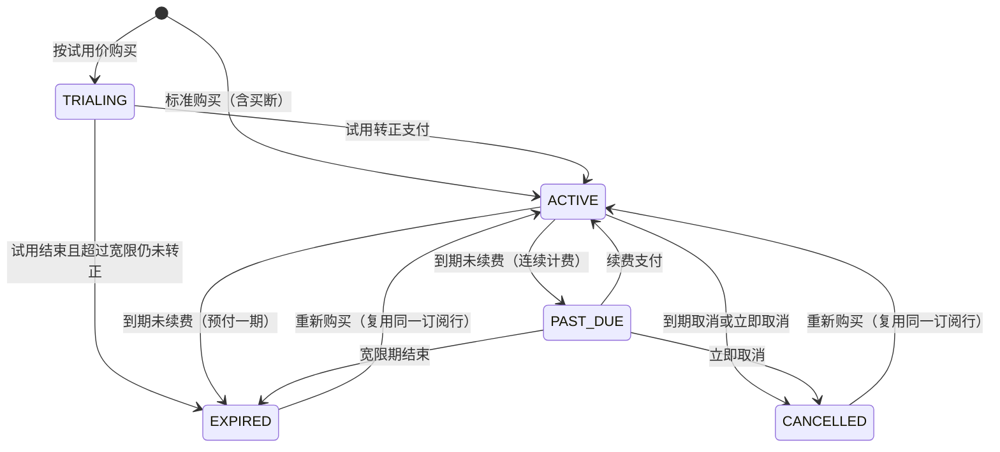

:::note 适用范围
本页适用于 **Halo 商城版 2.27.0 及以上版本**。传输与鉴权约定见[商城订阅对接](./index.md)，事件推送见[订阅 Webhook](./subscription-webhook.md)。
:::

## 数据模型

订阅由四层对象组成，由运营在控制台 **商店 → 商品** 中配置：

| 对象              | 说明                                                                                                                                                                   |
| ----------------- | ---------------------------------------------------------------------------------------------------------------------------------------------------------------------- |
| 产品线 Product    | `productType=SUBSCRIPTION` 的商品，例如「示例 Coding 套餐」。                                                                                                          |
| 档次 Tier         | 产品线下的商业等级，是**权益契约的归属单位**。`entitlements` 是任意 JSON，由接入方解释；同一档次下的月付与年付共享同一份契约。                                         |
| 计划 Plan         | 可购买的套餐，由档次 × 计费模式 × 周期组成，包含 `billingMode`、`billingPeriod`、`periodCount`、`price`、试用配置与数量上下限。计划与商品规格（`variantId`）一一对应。 |
| 订阅 Subscription | 某客户在某条产品线下的实例，保存状态、周期与 `effectiveEntitlements` 快照。                                                                                            |

产品线策略决定同一客户能否并存多条订阅、试用是否只发一次、到期前提前几天提醒：

| 策略                   | 说明                                                                                                                                              |
| ---------------------- | ------------------------------------------------------------------------------------------------------------------------------------------------- |
| `singleSubscription`   | 为 `true` 时同一客户在同一产品线同时只有一条生效订阅，再次购买会作用于已有订阅；为 `false` 时每次购买都会新建一条独立订阅，各自续费、变更与取消。 |
| `trialOncePerCustomer` | 试用是否按客户只发一次（以该客户在该产品线是否有历史订阅判断）。                                                                                  |
| `renewalLeadDays`      | 到期前多少天发送续费提醒，默认 5 天。                                                                                                             |

计划字段中与周期相关的取值：

| 取值                               | 说明                                                                           |
| ---------------------------------- | ------------------------------------------------------------------------------ |
| `billingMode=SUBSCRIPTION`         | 连续计费：到期前提醒，到期未付进入 `PAST_DUE` 宽限期，客户可手动续费。         |
| `billingMode=ONE_TIME`             | 预付一期：到期直接 `EXPIRED`，需要重新购买。                                   |
| `billingMode=LIFETIME`             | 买断：周期字段为空，永不过期。                                                 |
| `billingPeriod=MONTHLY` / `YEARLY` | 周期单位；季度付是 `MONTHLY` 加 `periodCount=3`。                              |
| `gracePeriodDays`                  | 仅连续计费有效：到期未付后的容忍天数。                                         |
| `entitlements`                     | 档次上的 JSON 契约，在购买、变更、续费时快照到订阅的 `effectiveEntitlements`。 |

接入方需要长期依赖的关联键：

- `customerId`：商城客户 ID，用于与接入方账号对齐（控制台可通过顾客接口换取 `userId`、邮箱）。
- `productId`：产品线 ID。
- `planId`：档次内的具体套餐，请以此判断档位，不要用价格或名称。
- `variantId`：计划对应的商品规格 ID，订单行使用它标识订阅行。

## 状态机



| 状态        | 含义                                 | 是否仍在履约 |
| ----------- | ------------------------------------ | ------------ |
| `TRIALING`  | 试用中，只收了试用价                 | 是           |
| `ACTIVE`    | 生效中                               | 是           |
| `PAST_DUE`  | 周期已到期，仍在宽限期内（连续计费） | 是           |
| `CANCELLED` | 已取消                               | 否           |
| `EXPIRED`   | 已过期                               | 否           |

`TRIALING`、`ACTIVE`、`PAST_DUE` 统称为**生效订阅**。只有生效订阅会阻止同一客户重复购买（`singleSubscription=true` 时），权益查询也只返回这些订阅。

## 周期与时间字段

| 字段                          | 含义                                                                               |
| ----------------------------- | ---------------------------------------------------------------------------------- |
| `trialStartAt` / `trialEndAt` | 试用起止；没有试用时为 `null`。                                                    |
| `currentPeriodStartAt`        | 当前周期起点。                                                                     |
| `currentPeriodEndAt`          | 当前周期终点。**试用期间它表示「转正后第一个周期」的终点**，此时首期费用尚未收取。 |
| `paidThroughAt`               | 已付费覆盖到的终点。买断（`LIFETIME`）为 `null`。                                  |

周期长度按 UTC 计算：`MONTHLY` 使用 `plusMonths(periodCount)`，`YEARLY` 使用 `plusYears(periodCount)`。

一条订阅通常经历以下阶段：

1. **购买（PURCHASE）**：支付成功后开通订阅，写入首个周期与权益快照。命中试用时为 `TRIALING`，否则为 `ACTIVE`；买断订阅的周期字段为 `null`。
2. **试用转正（TRIAL_CONVERT）**：客户在客户中心续费（试用期使用同一入口）并支付后转为 `ACTIVE`，首期从 `trialEndAt` 起算。
3. **续费（RENEWAL）**：客户手动续费并支付后，覆盖终点顺延一个周期，状态保持或恢复为 `ACTIVE`。
4. **到期**：连续计费进入 `PAST_DUE` 并开始宽限期；预付一期直接 `EXPIRED`；已勾选到期取消则转为 `CANCELLED`。
5. **计划变更（PLAN_CHANGE）**：支付完成（或免费变更）后立即生效，并**从生效时刻重新开一期**。
6. **取消（CANCEL）**：客户勾选到期取消后 `cancelAtPeriodEnd=true`，当期继续有效，到期转为 `CANCELLED`。

## 续费与到期

Halo **不保存支付凭据，也不会自动扣款**，任何续费都必须由客户主动发起：

- 到期前 `renewalLeadDays` 天，Halo 发送一次 `SUBSCRIPTION_RENEWAL_REMINDER` 并给客户发提醒邮件；同一个到期时点只发一次，已勾选到期取消的订阅不发提醒。
- 客户在客户中心点击续费，生成一张续费订单（连续计费）或转正订单（试用中），支付成功后周期与状态更新。
- 续费、转正、变更订单与普通订单一致，**24 小时未支付会自动过期**；价格按下单时的现价计算，订阅上不保存价格快照。
- 试用到期后不会自动生成转正订单；超过 `trialEndAt` 加宽限期（`gracePeriodDays`，最少 1 天）仍未支付即 `EXPIRED`。
- 到期转移顺序：`cancelAtPeriodEnd=true` 优先转为 `CANCELLED`；否则连续计费进入 `PAST_DUE`，预付一期直接 `EXPIRED`。

:::tip 代付
如需为客户钱包自动扣款，需要在客户登录态下发起续费（客户中心接口）取得订单，再由运营侧令牌调用 `POST /orders/{id}/mark-as-paid` 完成支付。Halo 当前没有面向接入方的「代客户创建续费单」接口。
:::

## 计划变更

- 只支持**升级与平移**，且两端必须是相同的 `billingPeriod`；降级与跨周期变更不被支持。
- 每个方向都必须由运营显式配置一条**启用中的变更规则**（`fromPlanId → toPlanId`）。没有规则的方向一律拒绝，即使是升级。
- 费用模式由规则决定：`FREE`（免费，立即生效且不产生订单）、`FIXED_FEE`（按固定单价 × 数量）、`PRORATED`（新一期全价减去当前计划未使用的剩余价值，基数为计划标价）。
- **变更会重置周期**：生效后 `currentPeriodStartAt` 为生效时刻，`currentPeriodEndAt` 与 `paidThroughAt` 为生效时刻加目标计划的周期。接入方必须使用事件或查询返回的新的 `paidThroughAt` 更新到期时间，不要沿用旧到期日，也不要按剩余天数顺延。
- 变更不修改数量，数量沿用订阅当前值。
- 订阅已过期或已取消、仍在试用期、存在待支付变更单时，变更会被拒绝。

## 取消

- 客户在客户中心取消（默认到期取消）：写入 `cancelAtPeriodEnd=true`，当期权益继续有效，到期时转为 `CANCELLED`。
- 立即取消仅在该订阅已进入 `PAST_DUE` 时允许客户自助发起；运营可以在控制台对未终止的订阅立即取消。
- 试用中的订阅勾选到期取消后，到期会按试用过期处理并进入 `EXPIRED`。

## 权益如何判定

`entitlements` 是运营与接入方约定的契约，Halo 只负责快照与下发，不解释也不强制执行。**权益截止时间必须按状态分支判断**，不能直接使用 `currentPeriodEndAt`：

| 状态                                 | 权益截止时间                                     |
| ------------------------------------ | ------------------------------------------------ |
| `TRIALING`                           | `trialEndAt`（试用期只收了试用价）               |
| `ACTIVE` / `PAST_DUE`                | `paidThroughAt`，为空时回退 `currentPeriodEndAt` |
| 买断（`ACTIVE` 且周期字段为 `null`） | 无终点，永不过期                                 |
| `CANCELLED` / `EXPIRED`              | 已无权益，`paidThroughAt` 只是历史覆盖记录       |

```ts
// 按状态分支计算权益截止时间
function coveredUntilAt(s: Subscription): string | null {
  switch (s.status) {
    case "TRIALING":
      return s.trialEndAt;
    case "ACTIVE":
    case "PAST_DUE":
      // 买断订阅两者均为 null，返回 null 表示永不过期
      return s.paidThroughAt ?? s.currentPeriodEndAt;
    default:
      return null; // CANCELLED / EXPIRED：停用权益
  }
}
```

需要注意：

- `TRIALING` 期间 `currentPeriodStartAt` / `currentPeriodEndAt` 描述的是转正后的第一个周期，**不能当作当前有效周期**，直接使用会把到期时间显示成「试用结束加一个周期」。
- 权益快照在**购买、变更应用、续费**时重算。运营修改档次的 `entitlements` 不会立即推送给已有订阅，要等下一次续费或变更。
- 收到快照后请整体覆盖本地权益，不要在本地累加周期或额度。

## 查询与对账接口

Console API（前缀 `https://{host}/apis/console.api.ecommerce.halo.run/v1alpha1`，需要管理员令牌）：

| 方法 | 路径                                                        | 用途                                                                                                    |
| ---- | ----------------------------------------------------------- | ------------------------------------------------------------------------------------------------------- |
| GET  | `/subscriptions?customerId=&productId=&status=&page=&size=` | 订阅列表                                                                                                |
| GET  | `/subscriptions/{id}`                                       | 订阅详情，含 `effectiveEntitlements` 与 `upcomingRenewal`                                               |
| GET  | `/customers/{customerId}/entitlements?productId=`           | **权益二次确认**：返回 `{ customerId, productId, entitlements }`，没有生效订阅时 `entitlements` 为 `{}` |
| GET  | `/subscription-changes?subscriptionId=`                     | 变更流水，含 `orderId`、计价结果与前后快照                                                              |
| POST | `/subscriptions/{id}/cancel`                                | 运营立即取消                                                                                            |
| POST | `/orders/{id}/mark-as-paid`                                 | 代付：把续费或变更订单标记为已支付                                                                      |
| POST | `/orders/{id}/cancel`                                       | 取消未支付的续费或变更订单                                                                              |

客户中心 API（前缀 `https://{host}/apis/uc.api.ecommerce.halo.run/v1alpha1`，需要客户登录态）由 Halo 页面使用，接入方通常不需要直接调用；如需代客户发起，必须在客户登录态下调用：

| 方法 | 路径                                                               | 说明                                             |
| ---- | ------------------------------------------------------------------ | ------------------------------------------------ |
| GET  | `/subscriptions`、`/subscriptions/{id}`                            | 我的订阅与详情                                   |
| POST | `/subscriptions/{id}/changes/quote`、`/subscriptions/{id}/changes` | 变更报价与执行                                   |
| POST | `/subscriptions/{id}/cancel`                                       | 取消，请求体 `{"immediate": false}` 表示到期取消 |
| POST | `/subscriptions/{id}/renew`                                        | 手动续费出单，试用期为转正单                     |
| GET  | `/subscription-changes?subscriptionId=`                            | 变更时间线                                       |

:::warning 客户中心接口路径没有 `/uc` 段
客户中心接口的路径是 `/apis/uc.api.ecommerce.halo.run/v1alpha1/subscriptions`，**不要**再加一层 `/uc`。写成 `/v1alpha1/uc/subscriptions` 会因权限校验把首段路径当作资源名而返回 `403`。
:::

:::note 完整契约
以上仅为常用接口。字段与状态码的完整定义以运行实例的 API 文档为准（在线文档：[https://api.halo.run](https://api.halo.run)，分组为 `console.api.ecommerce.halo.run` 与 `uc.api.ecommerce.halo.run`）。
:::
