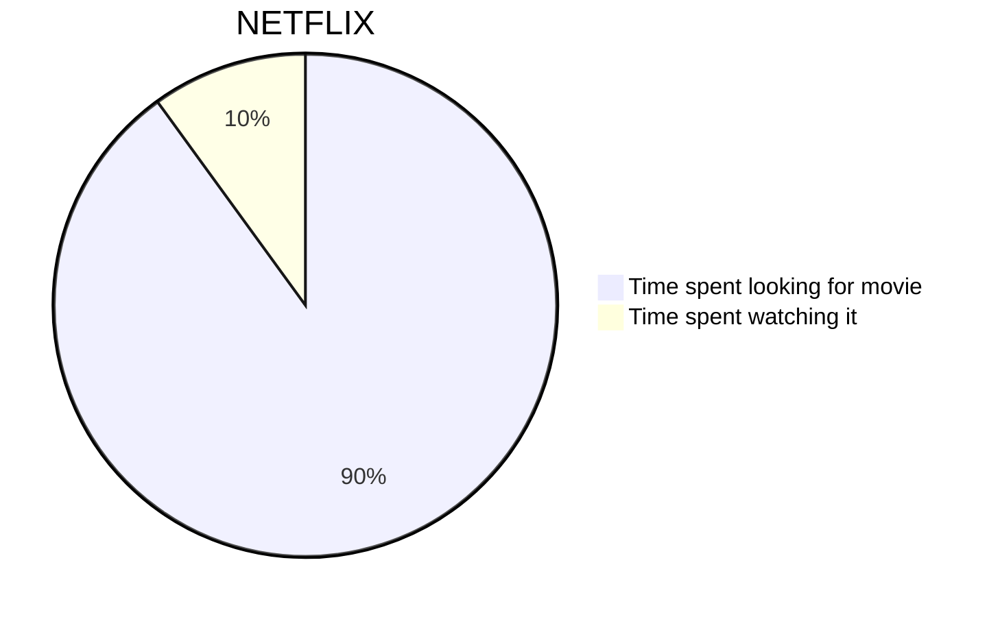

## 基础语法

Halo 使用的 `Markdown` 解析器为 [flexmark-java](https://github.com/vsch/flexmark-java)，基于 [CommonMark (spec 0.28)](https://spec.commonmark.org/0.28/) 标准开发，语法参考：[https://spec.commonmark.org/0.28/](https://spec.commonmark.org/0.28/)。

## 代码块

    ```language
    代码块
    ```

其中，language 为必填，如果不填写，很可能主题的代码高亮插件无法识别代码的语言，导致样式异常。举几个例子：

    ```java
    public static void main(String[] args){
        System.out.println("Hello World!");
    }
    ```

    ```javascript
    console.log("Hello World!")
    ```

## TOC

在文章的最前面加上 `[TOC]` 即可。

## 自动链接

支持自动将一个链接解析为可点击的格式，如下：

````markdown
https://halo.run
````

将被解析为：

```html
<a href="https://halo.run">https://halo.run</a>
```

## Emoji

支持将 Emoji 的文字形式转化为图片形式，如下：

```markdown
:100:
```

将被解析为：

```html
💯
```

更多 Emoji 表情可访问：[https://emoji.svend.cc](https://emoji.svend.cc)

## 数学公式

行内公式：

```markdown
$a \ne 0$
```

段落公式：

```markdown
$$
x = {-b \pm \sqrt{b^2-4ac} \over 2a}.
$$
```

> 需要注意的是，并不是每一款主题都支持显示数学公式，你可以先到你使用的主题设置中查看是否支持，如不支持，请看下面的解决方案。

首先，登陆到后台，进入 `系统 -> 博客设置 -> 其他设置`。将下面的代码复制到 `自定义内容页面 head`。

```html
<script src="//cdn.jsdelivr.net/npm/mathjax@2.7.5/unpacked/MathJax.js?config=TeX-MML-AM_CHTML" defer></script>
    <script>
    document.addEventListener('DOMContentLoaded', function () {
        MathJax.Hub.Config({
            'HTML-CSS': {
                matchFontHeight: false
            },
            SVG: {
                matchFontHeight: false
            },
            CommonHTML: {
                matchFontHeight: false
            },
            tex2jax: {
                inlineMath: [
                    ['$','$'],
                    ['\\(','\\)']
                ],
                displayMath: [["$$", "$$"], ["\\[", "\\]"]]
            }
        });
    });
</script>
```

## 图表

饼图：

````markdown

````

更多用法查看：[https://mermaidjs.github.io/#/](https://mermaidjs.github.io/#/)

> 需要注意的是，并不是每一款主题都支持显示图表，你可以先到你使用的主题设置中查看是否支持，如不支持，请看下面的解决方案。

首先，登陆到后台，进入 `系统 -> 博客设置 -> 其他设置`。将下面的代码复制到 `自定义内容页面 head`。

```html
<script src="https://cdn.jsdelivr.net/npm/mermaid@8.4.4/dist/mermaid.min.js"></script>
```

## 短连接

:::tip
> 这属于实验性特性，也许我们将在未来的版本移除这个特性。
:::

Halo 内置一些短连接以更好地支持一些 HTML 语法，但是编辑器目前并不能解析，只能发布之后才可以看到效果，如下：

### 网易云音乐

### Tabs {.tabset}
#### 语法

```markdown
[music:id]
```

#### 示例

```markdown
[music:32507038]
```

#### 解析结果

```html
<iframe frameborder="no" border="0" marginwidth="0" marginheight="0" width=330 height=86 src="//music.163.com/outchain/player?type=2&id=32507038&auto=1&height=66"></iframe>
```

### 哔哩哔哩动画

### Tabs {.tabset}
#### 语法

```markdown
[bilibili:aid,width,height]
```

#### 示例

```markdown
[bilibili:65898131,256,256]
```

#### 解析结果

```html
<iframe height="256" width="256" src="//player.bilibili.com/player.html?aid=65898131" scrolling="no" border="0" frameborder="no"  framespacing="0" allowfullscreen="true">  </iframe>
```

## 脚注

### Tabs {.tabset}
#### 语法

```markdown
[^脚注名]
[^脚注名]: 脚注内容
```

#### 示例

```markdown
驿外[^1]断桥边，寂寞开无主。已是黄昏独自愁，更着风和雨
[^1]: 驿（yì）外：指荒僻、冷清之地。驿，驿站。
```

#### 解析结果

```html
<p>驿外<sup class="footnote-ref"><a href="#fn1" id="fnref1">[1]</a></sup>断桥边，寂寞开无主。已是黄昏独自愁，更着风和雨</p>
<hr class="footnotes-sep">
<section class="footnotes">
<ol class="footnotes-list">
<li id="fn1" class="footnote-item"><p>驿（yì）外：指荒僻、冷清之地。驿，驿站。 <a href="#fnref1" class="footnote-backref">↩︎</a></p>
</li>
</ol>
</section>
```