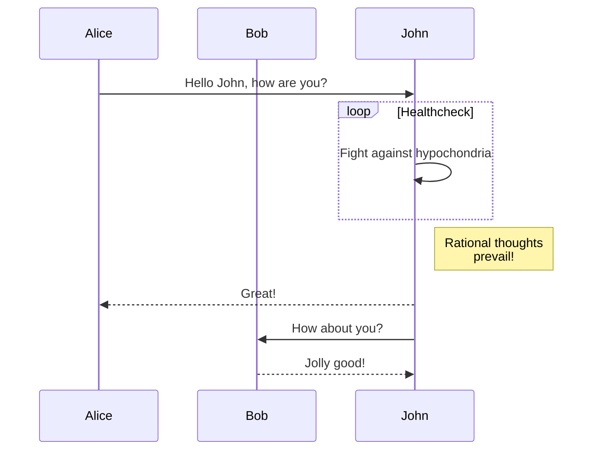

## 写在前面

从 1.5.0 版本开始，Halo 默认保存编辑器渲染的 html 文档。使用的 Markdown 渲染库为 [markdown-it](https://github.com/markdown-it/markdown-it)，我们也对此进行了封装：[@halo-dev/markdown-renderer](https://github.com/halo-dev/js-sdk/tree/master/packages/markdown-renderer)。后续我们会在任何需要渲染 Markdown 的地方都使用此库，保证 Markdown 渲染结果一致。

## 基础语法

markdown-it 使用了 [CommonMark spec](https://spec.commonmark.org) 规范，基础语法请参考 [CommonMark spec](https://spec.commonmark.org)。

## 自动链接（Auto Link）

支持自动将一个链接格式的文本转换为 a 标签链接。

语法规则：

```plain
https://halo.run
```

渲染结果：

```html
<a href="https://halo.run">https://halo.run</a>
```

预览：

<https://halo.run>

## 代码块（Code Block）

语法规则：

````markdown {1}
```language
内容
```
````

示例：

````markdown {1}
```java
public static void main(String[] args){
    System.out.println("Hello World!");
}
```
````

````markdown {1}
```javascript
console.log("Hello World!")
```
````

:::info
注意：代码高亮需要主题添加插件支持，不同的主题可能有实现差异。
:::

## 缩写（abbr）

语法规则：

```markdown
*[HTML]: Hyper Text Markup Language
*[W3C]:  World Wide Web Consortium 
The HTML specification
is maintained by the W3C.
```

渲染结果：

```html
<p>
    The
    <abbr title="Hyper Text Markup Language">
        HTML
    </abbr>
    specification
    <br />
    is maintained by the
    <abbr title="World Wide Web Consortium">
        W3C
    </abbr>
    .
</p>
```

## Attrs

此语法支持将 `id` `class` `target` 添加到渲染后的 HTML 标签上。

示例：

```markdown
# Halo {#halo}
```

```markdown
> Hello Halo {.info}
```

```markdown
[https://halo.run](https://halo.run) {target="_blank"}
```

渲染结果：

```html
<h1 id="halo" tabindex="-1">Halo</h1>
```

```html
<blockquote class="info"> <p>Hello Halo</p> </blockquote>
```

```html
<a href="https://halo.run" target="_blank">https://halo.run</a>
```

## Emoji

支持将 Emoji 的文字形式转化为图片形式。

示例：

```markdown
:100:
```

渲染结果：

```html
💯
```

## 脚注（Footnote）

语法规则：

```markdown
[^脚注名]
[^脚注名]: 脚注内容
```

示例：

```html
驿外[^1]断桥边，寂寞开无主。已是黄昏独自愁，更着风和雨
[^1]: 驿（yì）外：指荒僻、冷清之地。驿，驿站。
```

渲染结果：

```html
<p>
    驿外
    <sup class="footnote-ref">
        <a href="#fn1" id="fnref1">
            [1]
        </a>
    </sup>
    断桥边，寂寞开无主。已是黄昏独自愁，更着风和雨
</p>
<hr class="footnotes-sep">
<section class="footnotes">
    <ol class="footnotes-list">
        <li id="fn1" class="footnote-item">
            <p>
                驿（yì）外：指荒僻、冷清之地。驿，驿站。
                <a href="#fnref1" class="footnote-backref">
                    ↩︎
                </a>
            </p>
        </li>
    </ol>
</section>
```

## 下划线（ins）

示例：

```markdown
++inserted++
```

渲染结果：

```html
<ins>inserted</ins>
```

预览：

<ins>inserted</ins>

## 标记（mark）

示例：

```markdown
==marked==
```

渲染结果：

```html
<mark>marked</mark>
```

预览：

<mark>marked</mark>

## 下标（sub）

示例：

```markdown
H~2~0
```

渲染结果：

```html
H<sub>2</sub>0
```

预览：

H<sub>2</sub>0

## 上标（sup）

示例：

```markdown
29^th^
```

渲染结果：

```html
29<sup>th</sup>
```

预览：

29<sup>th</sup>

## 目录（TOC）

此语法支持根据标题生成文档目录。

示例：

```markdown
[toc]

# Heading

## Sub heading 1
Some nice text

## Sub heading 2
Some even nicer text
```

渲染结果：

```html
<p>
    <div class="table-of-contents">
        <ul>
            <li>
                <a href="#heading">
                    Heading
                </a>
                <ul>
                    <li>
                        <a href="#sub-heading-1">
                            Sub heading 1
                        </a>
                    </li>
                    <li>
                        <a href="#sub-heading-2">
                            Sub heading 2
                        </a>
                    </li>
                </ul>
            </li>
        </ul>
    </div>
</p>
<h1 id="heading" tabindex="-1">
    Heading
</h1>
<h2 id="sub-heading-1" tabindex="-1">
    Sub heading 1
</h2>
<p>
    Some nice text
</p>
<h2 id="sub-heading-2" tabindex="-1">
    Sub heading 2
</h2>
<p>
    Some even nicer text
</p>
```

## 任务列表（Task Lists）

示例：

```markdown
- [x] Apple
- [ ] Banana
```

渲染结果：

```html
<ul class="contains-task-list">
    <li class="task-list-item">
        <input class="task-list-item-checkbox" checked="" disabled="" type="checkbox">
        Apple
    </li>
    <li class="task-list-item">
        <input class="task-list-item-checkbox" disabled="" type="checkbox">
        Banana
    </li>
</ul>
```

预览：

- [x] Apple
- [ ] Banana

## 数学公式（Katex）

我们使用了 KaTeX 作为数学公式渲染的插件，因为从 1.5.0 开始，我们将直接保存编辑器渲染的内容，在保存的时候就已经保存了渲染好的 KaTeX 结构。所以在前台无需引入 KaTeX 插件来进行渲染，但目前仍需要引入 KaTeX 的样式文件，如果主题没有支持，可以在系统设置的 `自定义内容页 head：` 中加入以下代码：

```html
<link rel="stylesheet" href="https://unpkg.com/katex@0.12.0/dist/katex.min.css" />
```

### 行内公式

示例：

```markdown
$\sqrt{3x-1}+(1+x)^2$
```

预览：

Example：$\sqrt{3x-1}+(1+x)^2$

### 块级公式

示例：

```markdown
$$\begin{array}{c}

\nabla \times \vec{\mathbf{B}} -\, \frac1c\, \frac{\partial\vec{\mathbf{E}}}{\partial t} &
= \frac{4\pi}{c}\vec{\mathbf{j}}    \nabla \cdot \vec{\mathbf{E}} & = 4 \pi \rho \\

\nabla \times \vec{\mathbf{E}}\, +\, \frac1c\, \frac{\partial\vec{\mathbf{B}}}{\partial t} & = \vec{\mathbf{0}} \\

\nabla \cdot \vec{\mathbf{B}} & = 0

\end{array}$$
```

预览：

$$\begin{array}{c}

\nabla \times \vec{\mathbf{B}} -\, \frac1c\, \frac{\partial\vec{\mathbf{E}}}{\partial t} &
= \frac{4\pi}{c}\vec{\mathbf{j}}    \nabla \cdot \vec{\mathbf{E}} & = 4 \pi \rho \\

\nabla \times \vec{\mathbf{E}}\, +\, \frac1c\, \frac{\partial\vec{\mathbf{B}}}{\partial t} & = \vec{\mathbf{0}} \\

\nabla \cdot \vec{\mathbf{B}} & = 0

\end{array}$$

## 图表（Mermaid）

从 Halo 1.5.0 开始，编辑器支持渲染 Mermaid 图表为 svg 内容，并直接保存渲染后的内容，所以无需在前台引入 Mermaid 插件进行渲染。

示例：

````markdown

````

````markdown

````

预览：


## 短连接

参考 [1.4.17/Markdown 语法](https://docs.halo.run/1.4/user-guide/markdown#短连接)。目前已经在 1.5.x 移除，建议直接使用官方提供的嵌入代码。
