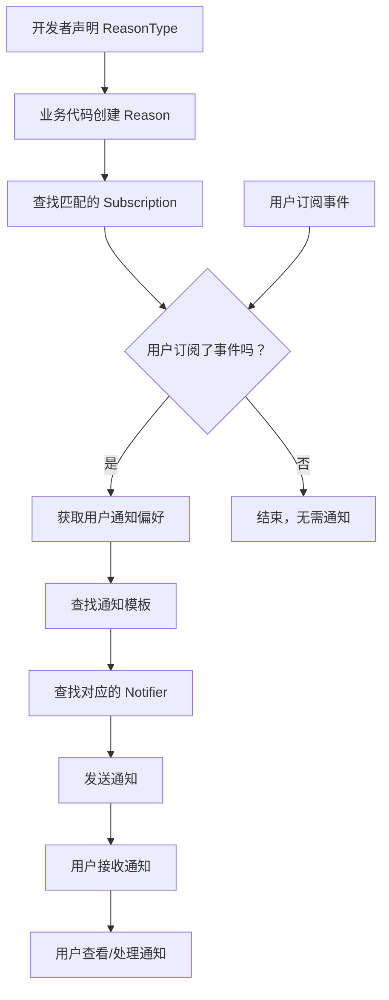

Halo 的通知功能提供了事件驱动的消息提醒机制，让用户能够及时获取系统内的关键事件。
开发者可以根据需求定义事件类型和通知方式（如站内消息、邮件等），并支持个性化的推送策略，提升用户体验和系统可扩展性。

通知系统通过事件机制将关键消息推送给用户。开发者可以自定义通知类型、消息格式和推送方式，主要应用于以下场景：

- 用户互动：如文章评论、点赞等；
- 订单和流程提醒：如订单创建、处理完成等；
- 内容更新：如文章发布、系统公告等。

## 通知系统工作流程

下图展示了 Halo 通知功能的工作流程，包括事件声明、订阅查找、通知发送等关键步骤。



1. 声明事件类型：开发者首先需要声明通知事件的类型 (ReasonType)，指定事件的名称、描述和事件所需的属性。
2. 插件触发事件：当插件中的某个业务操作发生时，插件需要触发相应的事件。
3. 创建 Reason 实例：Halo 根据发送的事件创建一个 Reason 实例，表示具体的事件信息，步骤 2 和 3 可以合并为`业务代码创建 Reason`。
4. 订阅查找：Halo 通知中心会根据事件的类型和属性查找匹配的订阅。
5. 通知发送：如果找到匹配的订阅，系统根据用户的偏好设置通过不同的通知器（如站内消息、邮件等）发送通知。
6. 用户接收和处理通知：用户通过预设的通知渠道接收事件通知，并可以在系统中查看或处理这些通知。

## 通知事件

在 Halo 通知系统中，`ReasonType` 和 `Reason` 是两个核心自定义模型，用于定义通知事件的类别和具体的事件实例。
理解它们的字段对于开发者扩展通知功能至关重要。

下面将详细说明这两个模型的字段及其作用。

### ReasonType 模型

`ReasonType` 是用于定义通知事件类别的模型。每个 `ReasonType` 都代表一类特定的事件，例如文章评论、新文章发布等。通过 `ReasonType`，系统可以了解该事件的特定属性和数据结构。
用户个人中心的通知设置页面会根据 `ReasonType` 的名称和描述展示事件类型和通知方式。

#### ReasonType 字段说明

| 字段名             | 类型     | 是否必填 | 说明                                                |
| ------------------ | -------- | -------- | --------------------------------------------------- |
| `apiVersion`       | `string` | 是       | API 版本号，定义为 `notification.halo.run/v1alpha1` |
| `kind`             | `string` | 是       | 自定义资源类型，必须为 `ReasonType`                 |
| `metadata.name`    | `string` | 是       | 事件类别的唯一标识名称，例如 `comment`              |
| `spec.displayName` | `string` | 是       | 事件类别的展示名称，用户界面中显示的事件名称        |
| `spec.description` | `string` | 否       | 事件类别的描述，说明此事件的用途和含义              |
| `spec.properties`  | `array`  | 是       | 此事件包含的属性字段，用于定义该类事件应携带的数据  |

#### spec.properties 字段

`properties` 字段用于定义该通知事件需要传递的参数或属性。每个属性都是一个对象，通常包含以下字段：

| 字段名        | 类型      | 是否必填 | 说明                                                     |
| ------------- | --------- | -------- | -------------------------------------------------------- |
| `name`        | `string`  | 是       | 属性的名称，表示事件数据中的某个字段                     |
| `type`        | `string`  | 是       | 属性的数据类型，例如 `string`、`boolean` 等，仅用于描述  |
| `description` | `string`  | 否       | 对该属性的描述，说明其在事件中的作用                     |
| `optional`    | `boolean` | 否       | 该属性是否为可选字段，默认值为 `false`，`false` 表示必填 |

`properties.type` 字段仅用于文档性目的，不会在运行时进行数据类型检查。有了此描述，便于编写通知模板时使用正确的数据类型。

**示例：** 声明评论事件的 ReasonType

```yaml
apiVersion: notification.halo.run/v1alpha1
kind: ReasonType
metadata:
  name: comment
spec:
  displayName: "评论事件"
  description: "用户在文章上收到评论时触发。"
  properties:
    - name: postName
      type: string
      description: "文章的名称。"
    - name: commenter
      type: string
      description: "评论者用户名。"
    - name: content
      type: string
      description: "评论内容。"
```

在这个示例中，`ReasonType` 定义了一个评论事件，该事件包括三种属性：`postName`（文章名）、`commenter`（评论者）和 `content`（评论内容），这些属性在触发事件时将传递给通知系统。

这一类型的资源声明非常适合放在插件的 `resources` 目录下，以便插件安装时自动创建。参考 [声明自定义模型对象](./extension.md#declare-extension-object)

### Reason 模型

`Reason` 模型用于描述具体的事件实例，它是 `ReasonType` 的一个实例化，包含触发该事件时的具体数据。
`Reason` 通常在某个事件发生时创建，例如某篇文章收到评论时生成一个 `Reason`，记录具体的评论信息。

#### Reason 字段说明

| 字段名            | 类型     | 是否必填 | 说明                                                           |
| ----------------- | -------- | -------- | -------------------------------------------------------------- |
| `apiVersion`      | `string` | 是       | API 版本号，定义为 `notification.halo.run/v1alpha1`            |
| `kind`            | `string` | 是       | 自定义资源类型，必须为 `Reason`                                |
| `metadata.name`   | `string` | 是       | 该事件实例的唯一标识名称，通常自动生成                         |
| `spec.reasonType` | `string` | 是       | 引用的 `ReasonType` 名称，表示该事件实例属于哪个事件类型       |
| `spec.author`     | `string` | 是       | 事件的触发者或创建者，通常为用户或系统的标识符                 |
| `spec.subject`    | `object` | 是       | 事件的主题，指向该事件所涉及的具体对象（如文章、评论等）       |
| `spec.attributes` | `object` | 是       | 包含事件具体数据的键值对，内容与 `ReasonType` 中定义的属性一致 |

#### spec.subject 字段

`subject` 字段描述了与该事件相关的主体对象，例如，评论事件中的文章对象。`subject` 通常包含以下字段：

| 字段名       | 类型     | 是否必填 | 说明                                                    |
| ------------ | -------- | -------- | ------------------------------------------------------- |
| `apiVersion` | `string` | 是       | 主题对象的 API 版本号，例如 `content.halo.run/v1alpha1` |
| `kind`       | `string` | 是       | 主题对象的类型，例如 `Post` 表示文章                    |
| `name`       | `string` | 是       | 主题对象的唯一标识，通常是对象的名称或 ID               |
| `title`      | `string` | 是       | 主题对象的标题，通常是人类可读的名称                    |
| `url`        | `string` | 否       | 主题对象的访问链接或详情页面的 URL                      |

参考 [Reason 自定义模型](https://github.com/halo-dev/halo/blob/0d1a0992231fd5e66a65b4e9d426d3f373b1903f/api/src/main/java/run/halo/app/core/extension/notification/Reason.java)

#### spec.attributes 字段

`attributes` 字段用于存储该事件实例的具体数据。每个键值对表示一个 `ReasonType` 中定义的属性和其对应的值。

**示例：** 创建评论事件的 Reason

```yaml
apiVersion: notification.halo.run/v1alpha1
kind: Reason
metadata:
  name: comment-123
spec:
  reasonType: comment
  author: "访客"
  subject:
    apiVersion: 'content.halo.run/v1alpha1'
    kind: Post
    name: 'post-456'
    title: 'Halo 系统介绍'
    url: 'https://example.com/archives/456'
  attributes:
    postName: "Halo 系统介绍"
    commenter: "访客"
    content: "这是一篇非常有帮助的文章！"
```

在这个示例中，`Reason` 表示具体的评论事件。
它关联了 `comment` 这一 `ReasonType`，并提供了详细的事件信息，包括文章（subject）的标识信息以及评论的内容（attributes）。

通过 ReasonType 和 Reason，开发者可以定义和管理各种事件，并在事件发生时触发相应的通知逻辑。

## 通知模板

在 Halo 系统中，通知模板用于定义每种通知类型的展示格式和内容结构。每当触发某个通知事件时，系统会根据事件的类型选择相应的通知模板，并将事件的属性嵌入到模板中生成最终的通知内容。如果未定义通知模板，则系统无法确定通知的具体格式和内容，这可能导致通知发送失败。因此，定义通知模板是实现通知功能的关键步骤。

### 通知模板的基本结构

通知模板是通过 `NotificationTemplate` 自定义模型定义的。
每个模板指定了与某个事件类型 (ReasonType) 关联的内容格式，包括通知的标题、正文内容等。
模板内容可以使用属性占位符，以便在通知生成时自动填充事件属性。Halo 支持使用 [Thymeleaf](https://www.thymeleaf.org/) 模板引擎进行内容渲染。

#### 通知模板字段说明

| 字段名                           | 类型     | 是否必填 | 说明                                                |
| -------------------------------- | -------- | -------- | --------------------------------------------------- |
| `apiVersion`                     | `string` | 是       | API 版本号，定义为 `notification.halo.run/v1alpha1` |
| `kind`                           | `string` | 是       | 自定义资源类型，必须为 `NotificationTemplate`       |
| `metadata.name`                  | `string` | 是       | 模板的唯一标识名称                                  |
| `spec.reasonSelector.reasonType` | `string` | 是       | 关联的事件类型 (`ReasonType`) 名称                  |
| `spec.reasonSelector.language`   | `string` | 是       | 模板语言，固定写为 `default`                        |
| `spec.template.title`            | `string` | 是       | 通知的标题模板，支持占位符                          |
| `spec.template.rawBody`          | `string` | 是       | 通知的正文模板，应当是纯文本，支持占位符            |
| `spec.template.htmlBody`         | `string` | 是       | 通知的正文模板，格式为 HTML 的模板，支持占位符      |

#### 定义通知模板

定义通知模板时，开发者需要指定模板的 `reasonSelector`，用于与事件类型关联，并在 `template` 中定义通知标题和内容的格式。

`spec.reasonSelector.language` 字段用于指定模板的语言，设计支持多语言，但目前 Halo 没有提供保存用户语言偏好的入口，因此只能使用 `default`。

模板内容支持纯文本和 HTML 格式，建议开发者两种内容都提供，以适应不同的通知渠道。比如邮件通知需要 HTML 格式，而短信通知则仅支持纯文本。

**示例：** 定义评论事件的通知模板

假设我们需要为“新评论”事件定义一个通知模板，该模板包括事件的标题和正文内容：

```yaml
apiVersion: notification.halo.run/v1alpha1
kind: NotificationTemplate
metadata:
  name: template-new-comment-on-post
spec:
  reasonSelector:
    reasonType: new-comment-on-post
    language: default
  template:
    title: "你的文章 [(${subject.title})] 收到了一条新评论"
    rawBody: |
      评论者 [(${author.name})] 评论了您的文章 [(${subject.title})]，内容如下：
      [(${props.comment})]
    htmlBody: |
      <p>评论者 <strong>[(${author.name})]</strong> 评论了您的文章 <a href="[(${subject.url})]">[(${subject.title})]</a>，内容如下：</p>
      <p>[(${props.comment})]</p>
```

参考 [Halo 默认通知模板 YAML](https://github.com/halo-dev/halo/blob/0d1a0992231fd5e66a65b4e9d426d3f373b1903f/application/src/main/resources/extensions/notification-templates.yaml)

#### 通知模板设计小技巧与最佳实践

##### 合理使用占位符

在通知模板中，使用占位符来动态插入事件数据是提高模板灵活性的关键。占位符的设计应遵循以下规则：

- 使用清晰的命名：占位符应具有明确的含义，例如 `[(${quoteReplyName})]` 表示引用回复的名称，让代码更具可读性，建议使用 `CamelCase` 命名规范，不要使用嵌套对象作为变量如 `subject.title`。
- 避免嵌套复杂表达式：为了避免通知生成的内容过于复杂，建议在模板中尽量使用简单的占位符。复杂逻辑应在事件触发时处理，尽量保持模板的简洁。
- 确保属性完整性：占位符应与 ReasonType 中定义的属性一致，避免由于属性缺失导致的通知发送错误。

##### 提供多种格式的内容

在 Halo 中，不同的通知渠道可能支持不同格式的内容，建议模板中同时提供纯文本和 HTML 格式，以便适应各类通知渠道需求。

- 纯文本格式：适合即时通讯类应用消息和短信通知，尽量简洁明了，关注重点信息。
- HTML 格式：适合富文本展示渠道，如邮件通知。HTML 模板可使用简单的样式和链接，帮助用户更好地理解通知内容。
- 适配不同渠道的内容：对于可能发送到多渠道的通知，可以在不同格式中包含适合该渠道的具体内容，如 HTML 中使用 `<a>` 标签提供链接，而纯文本只展示简洁的链接地址。
- 如果在模板中需要用到日期，建议提前将其格式化为带时区的日期字符串，避免在模板中使用复杂的日期格式化。

##### 模板语法

Halo 使用 Thymeleaf 模板引擎来渲染通知模板，开发者可以在模板中使用 Thymeleaf 的语法来处理模板中的逻辑和数据。

- 对于纯文本如标题和 `rawBody`，使用 Thymeleaf 的 [Textual syntax](https://www.thymeleaf.org/doc/tutorials/3.1/usingthymeleaf.html#textual-syntax) 语法来引用变量和表达式。
其取值格式为：`[(${expression})]`，例如 `[(${title})]`。
- 对于 HTML 内容如 `htmlBody`，使用 Thymeleaf 的 [Standard syntax](https://www.thymeleaf.org/doc/tutorials/3.1/usingthymeleaf.html#standard-syntax) 语法。
其取值格式为：`${expression}`，例如 `${title}`。

#### 模板渲染与发送

在通知事件触发时，Halo 通知中心会查找与该事件 `ReasonType` 匹配的 `NotificationTemplate`，并将事件数据填充到模板中生成最终通知内容。
没有定义模板的事件将无法发送通知，因此为每个 `ReasonType` 定义模板是保证通知发送成功的前提。

可以有多个相同的 `reasonSelector` 绑定到同一个事件类型，比如 `reasonType=new-comment-on-post`且 `language=default` 的模板存在多个，Halo 会**选择最近创建的模板**。
根据这个特点，**插件或主题开发者可以提供自己的通知模板以覆盖默认的通知模板**。

在生成通知内容时，系统还会提供一些额外的全局属性（如 `site.title` 等），这些属性可以在模板中直接使用：

| 字段名                   | 类型     | 说明                         |
| ------------------------ | -------- | ---------------------------- |
| `site.title`             | `string` | 站点标题                     |
| `site.subtitle`          | `string` | 站点副标题                   |
| `site.logo`              | `string` | 站点 Logo URL                |
| `site.url`               | `string` | 站点外部访问地址             |
| `subscriber.displayName` | `string` | 订阅者显示名称               |
| `subscriber.id`          | `string` | 订阅者唯一标识符             |
| `unsubscribeUrl`         | `string` | 退订地址，用于取消订阅的链接 |

## 触发通知事件

在 Halo 系统中，通知功能的核心是通过触发特定的事件，生成相应的 Reason 实例，然后通过系统的通知机制将该事件通知给订阅者。
Halo 提供了 `NotificationReasonEmitter` 接口，开发者可以通过它轻松触发通知事件，将业务逻辑与通知机制结合起来。

### 工作机制

`NotificationReasonEmitter` 的作用是简化事件触发和通知的处理流程，它的主要职责是：

- 接收业务事件的参数，生成 `Reason` 实例。
- 将 `Reason` 实例与 `ReasonType` 进行匹配，触发事件。
- 通过 Halo 的通知系统，将事件推送给订阅了该事件的用户。

定义参考 [NotificationReasonEmitter](../../basics/server/object-management.md#notificationreasonemitter)

- `reasonType`：事件类型的名称，对应于 `ReasonType` 的 `metadata.name` 字段。
- `reasonData`：事件数据的构建器，用于构建 `Reason` 实例的属性。

Reason 数据的构建器有以下属性:

```java
public class ReasonPayloadBuilder {
    private Reason.Subject subject;
    private UserIdentity author;
    private Map<String, Object> attributes;
}
```

- `subject`：事件的主体对象，参考 `Reason` 中的 `spec.subject` 字段。
- `author`：事件的触发者，通常是用户或系统的标识符，这是一个 `UserIdentity` 对象，如果作者是匿名的则需要传递邮箱地址来构造，比如评论者可能没有关联具体用户而仅仅是邮箱地址。
- `attributes`：事件的具体数据，包含了 `ReasonType` 中定义的属性和对应的值，如果必填字段没有传递则会抛出异常。

使用场景举例：

- 当用户在博客上发表文章时，触发“新文章发布”事件，通知订阅了该事件的用户。
- 当用户在文章上发表评论时，触发“评论回复”事件，通知文章作者或订阅了评论的用户。
- 当管理员处理插件订单时，触发“订单创建”事件，通知管理员新订单的详情。

### 示例 {#reason-emitter-example}

假设我们需要在用户发布的文章时有新评论时，向订阅了“文章有新评论”事件的用户发送通知。可以通过 `NotificationReasonEmitter` 实现如下逻辑。

第一步：在你的插件代码中注入 `NotificationReasonEmitter`。

```java
import run.halo.app.notification.NotificationReasonEmitter;

@Service
@RequiredArgsConstructor
public class CommentEventListener {

  private final NotificationReasonEmitter notificationReasonEmitter;
}
```

第二步：有新评论被创建时触发

```java
import run.halo.app.core.extension.content.Comment;
import run.halo.app.core.extension.content.Post;

@Async
@EventListener(CommentCreatedEvent.class)
public void onNewComment(CommentCreatedEvent event) {
  Comment comment = event.getComment();
  Ref subjectRef = comment.getSpec().getSubjectRef();
  Post post = client.fetch(Post.class, subjectRef.getName()).orElseThrow();
  // 评论的主体是文章，因此构建文章的主体对象
  var reasonSubject = Reason.Subject.builder()
    .apiVersion(post.getApiVersion())
    .kind(post.getKind())
    .name(subjectRef.getName())
    .title(post.getSpec().getTitle())
    .url(postUrl)
    .build();
  // new-comment-on-post 用于表示 ReasonType 的 metadata.name
  notificationReasonEmitter.emit("new-comment-on-post",
    builder -> {
        // 定义了一个类型用于保存评论事件的数据，避免 map 的 key 写错
        var attributes = CommentOnPostReasonData.builder()
            .postName(subjectRef.getName())
            .postOwner(post.getSpec().getOwner())
            .postTitle(post.getSpec().getTitle())
            .postUrl(postUrl)
            .commenter(owner.getDisplayName())
            .content(comment.getSpec().getContent())
            .commentName(comment.getMetadata().getName())
            .build();
        // 将 CommentOnPostReasonData 转换为事件所需的 Map 类型数据
        builder.attributes(toAttributeMap(attributes))
            .author(identityFrom(owner))
            .subject(reasonSubject);
    }).block();
}

public static <T> Map<String, Object> toAttributeMap(T data) {
  Assert.notNull(data, "Reason attributes must not be null");
  return JsonUtils.mapper().convertValue(data, new TypeReference<>() {
  });
}
```

参考 [Halo 评论事件触发](https://github.com/halo-dev/halo/blob/0d1a0992231fd5e66a65b4e9d426d3f373b1903f/application/src/main/java/run/halo/app/content/comment/CommentNotificationReasonPublisher.java#L89)

## 订阅通知

在 Halo 系统中，用户可以通过订阅通知来接收感兴趣的事件，并且可以使用表达式对事件进行过滤，确保只接收到符合条件的通知。
通过这种方式，用户可以精确订阅某些事件，并避免被无关的事件打扰。
订阅机制支持根据事件属性、主体对象和事件发起人来过滤事件，并使用 SpEL（Spring Expression Language）编写过滤表达式。

### 订阅通知的工作机制

通知订阅机制允许用户订阅各种类型的事件（如文章发布、评论回复等），并且支持通过表达式过滤事件。

订阅系统可以通过以下三种根对象来筛选感兴趣的事件：

- props：事件属性的根对象，表示事件携带的具体数据。例如，在评论回复事件中，属性可以是 `{repliedOwner: 'guqing'}`，可以通过 `props.repliedOwner` 来访问 `repliedOwner` 属性。
- subject：事件的主体对象，表示事件所关联的核心对象，字段同 `Reason` 中的 `spec.subject` 字段。例如，在“新评论”事件中，subject 是评论所属的文章。
- author：事件的发起人，表示触发事件的用户标识符，字符串类型。例如，在评论事件中，发起人是评论者。

通过这些对象，订阅者可以编写表达式来对事件进行过滤。

表达式的结果必须为布尔值，用于判断当前事件是否符合订阅者的条件。

### 表达式过滤规则

使用 [SpEL](https://docs.spring.io/spring-framework/reference/core/expressions.html) 规范，开发者可以通过以下方式过滤事件：

- props：访问事件的属性。例如，`props.repliedOwner == 'guqing'` 用于筛选事件属性中 repliedOwner 为 guqing 的事件。
- subject：访问事件主体的属性。例如，`subject.kind == 'Post'` 用于筛选主体为 Post 的事件。
- author：访问事件的发起人。例如，`author == 'guqing'` 用于筛选 guqing 发起的评事件。

### 订阅方式

目前 Halo 没有提供用户界面来订阅通知，订阅均是通过事件发起前由开发者为用户创建的订阅对象来实现的。
因此，开发者需要在插件中实现订阅逻辑，为用户创建订阅对象，需要注意以下几点：

1. 订阅对象的创建需要在用户订阅事件前完成，否则用户无法接收到通知。
2. 哪些用户能够接收到通知需要开发者谨慎考虑，确保用户订阅的事件是符合其需求的，避免将无关的事件推送给用户。
3. 在创建订阅时，同样的逻辑反复执行不会重复创建订阅，因此可以在每次事件触发前订阅。

Halo 提供 `NotificationCenter` Bean 来帮助开发者创建订阅对象和取消订阅对象。

参考 [NotificationCenter Bean](../../basics/server/object-management.md#notificationcenter)

`subscribe` 方法用于订阅事件，`unsubscribe` 方法用于取消订阅事件，第一个参数是订阅者，第二个参数是感兴趣的事件。

#### Subscription.Subscriber

`Subscription.Subscriber` 具有以下属性：

| 字段名 | 类型     | 是否必填 | 说明                                                     |
| ------ | -------- | -------- | -------------------------------------------------------- |
| `name` | `string` | 是       | 订阅者的用户名，或通过 `UserIdentity` 构建的匿名订阅标识 |

#### Subscription.InterestReason

`Subscription.InterestReason` 具有以下属性：

| 字段名       | 类型     | 是否必填 | 说明                                                                 |
| ------------ | -------- | -------- | -------------------------------------------------------------------- |
| `reasonType` | `string` | 是       | 感兴趣的事件类型的名称，对应于 `ReasonType` 的 `metadata.name` 字段  |
| `expression` | `string` | 是       | 订阅事件的过滤表达式，用于过滤感兴趣的事件避免用户接收到不相关的通知 |

参考 [Subscription 自定义模型](https://github.com/halo-dev/halo/blob/0d1a0992231fd5e66a65b4e9d426d3f373b1903f/api/src/main/java/run/halo/app/core/extension/notification/Subscription.java)

### 示例 {#subscribe-example}

以下是一个通过 Java 代码实现订阅文章“新评论”通知的示例。该示例展示了如何使用表达式来筛选事件，只接收特定文章下的评论通知。

```java
// step 0: 依赖注入 NotificationCenter
private final NotificationCenter notificationCenter;

Mono<Void> subscribeNewCommentOnPostNotification(String username) {
  // step1: 创建订阅者对象
  var subscriber = new Subscription.Subscriber();
  subscriber.setName(username);  // 设置订阅者的用户名

  // step2: 创建感兴趣的事件类型对象
  var interestReason = new Subscription.InterestReason();
  // 设置订阅的事件类型为“新评论”
  interestReason.setReasonType(NEW_COMMENT_ON_POST);

  // step3: 使用表达式过滤事件，props 是事件属性的根对象
  // 只接收由指定用户创建的文章下的评论事件
  interestReason.setExpression("props.repliedOwner == '%s'".formatted(username));

  // step4: 订阅事件
  return notificationCenter.subscribe(subscriber, interestReason);
}
```

在这个示例中，我们通过以下步骤实现了订阅：

1. 创建订阅者对象：通过 `Subscription.Subscriber()` 实例化一个订阅者对象，并为其设置订阅者的用户名。
2. 定义感兴趣的事件类型：使用 `Subscription.InterestReason()` 定义感兴趣的事件类型，这里使用 `NEW_COMMENT_ON_POST` 表示订阅“新评论”事件。
3. 使用表达式过滤事件：通过表达式 `props.repliedOwner == '%s'`，订阅者只会接收到`被评论者/回复者`是他们自己的评论通知。
4. 执行订阅操作：调用 `notificationCenter.subscribe(subscriber, interestReason)` 方法完成订阅操作。

参考 [Halo 评论订阅](https://github.com/halo-dev/halo/blob/0d1a0992231fd5e66a65b4e9d426d3f373b1903f/application/src/main/java/run/halo/app/core/reconciler/CommentReconciler.java#L70)

## 通知器

开发者可以通过 Halo 的通知器机制扩展通知的发送方式。

参考 [通知器扩展点](../../extension-points/server/notifier.md)
